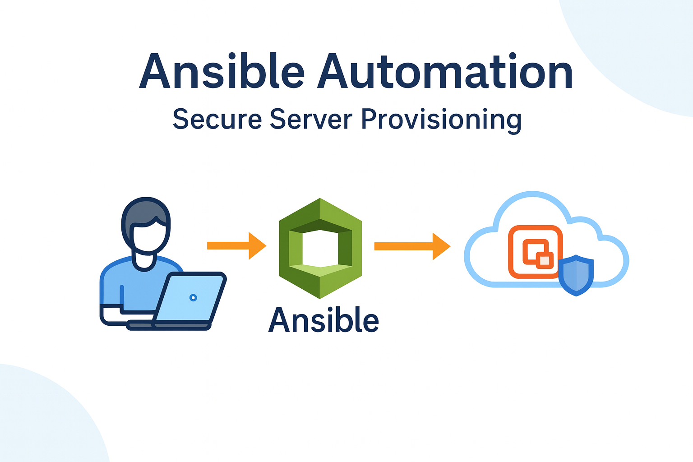

# Ansible Secure Automation Lab

Automated lab to provision, secure, patch and harden Linux servers and containers using **Ansible** on Azure.

---

## Table of Contents

- [Overview](#overview)
- [Real-World Risk](#real-world-risk)
- [What I Built](#what-i-built)
- [Diagram](#diagram)
- [Objectives](#objectives)
- [Steps Performed](#steps-performed)
  - [1. Azure Resource Setup]
  - [2. Ansible Install & Environment Prep]
  - [3. Project & Inventory Setup]
  - [4. Security Baseline Automation]
  - [5. Automated OS Patching]
  - [6. Secure User Management]
  - [7. Cleanup]
[Bonuses](#bonuses)
  - [1.1 Container Hardening]
  - [1.2 Docker CIS Bench Security Scan]
- [Screenshots](#screenshots)
- [Lessons Learned](#lessons-learned)
- [Notes and Limitations](#notes-and-limitations)
- [References](#references)
- [Contact](#contact)

---

## Overview

This project demonstrates **end-to-end automation of cloud server and container hardening** using Ansible on Azure. It covers initial provisioning, OS security baselines (SSH, firewall, patching), secure user management, Docker hardening and Docker CIS security checks—all automated and validated with clear documentation.

---

## Real-World Risk

Modern cloud servers face daily risks:  
- **Unpatched vulnerabilities**  
- **Weak SSH configurations**  
- **Default users and misconfigurations**  
- **Container security gaps**  

Automating security baselines is crucial for protecting production environments, especially at scale or in regulated industries.

---

## What I Built

- **Automated provisioning and hardening** of an Azure Linux VM.
- **Security baselines:** SSH hardening, firewall automation, patching and secure user management.
- **Container hardening:** Automated Docker install, secure daemon settings and **Docker CIS Bench** integration.
- **Full Ansible playbook & modular roles** with step-by-step validation.

---

## Diagram

---

## Objectives

- Provision a Linux VM in Azure with secure defaults.
- Automate initial hardening (firewall, SSH, NTP, package removal)
- Keep systems patched and up to date—**no manual intervention**.
- Enforce secure user management (SSH keys only, no defaults).
- Harden Docker and validate with **CIS Docker Bench**.
- Document everything for repeatability and recruiter visibility.

---

## Steps Performed

**1. Azure Resource Setup**
   - Created resource group, VNet, subnet, NSG, and a secure Ubuntu VM in the Azure portal *(Screenshots: `resource-group-creation.png`, `vm-creation-summary.png`, `vnet-creation.png`, `nsg-creation.png`, `nsg-ssh-restricted.png` & `vm-overview.png`)*

**2. Ansible Install & Environment Prep**
   - Connected via SSH using secure key auth.
   - Installed Ansible, updated OS, and validated the control node *(Screenshots: `ssh-login-success.png` & `ansible-version.png`)*

**3. Project & Inventory Setup**
   - Built modular Ansible project structure with roles for each security domain.
   - Created secure inventory and playbook *(Screenshot: `ansible-directory-structure.png`)*

**4. Security Baseline Automation**
   - Automated firewall (UFW) activation and SSH hardening:
     - Disabled password login and root SSH.
     - Allowed only port 22 from secure sources.
   - Set timezone, enabled NTP, and removed unnecessary packages *(Screenshots: `security-hardening-validation.png`, `ssh-hardening-playbook.png` & `security-checking.png`)*

**5. Automated OS Patching**
   - Automated full system updates and autoremove.
   - Validated status, including Ubuntu phased upgrades (if any) *(Screenshots: `patching-success.png` & `patching-verification-phased.png`)*

**6. Secure User Management**
   - Automated creation of privileged users with SSH keys (no passwords)
   - Removed default/guest/test users *(Screenshots: `user-key-verification.png` & `user-mgmt-output.png`)*

**7. Cleanup**
   - Deleted resource group in Azure to avoid lingering costs *(Screenshot: `azure-rg-delete.png`)*
     
---

## Bonuses

**1.1 Container Hardening**
   - Automated Docker CE install from the official repo.
   - Enforced secure Docker daemon config (user namespaces, disabled legacy APIs)
   - Added user to docker group securely *(Screenshot: `container-hardening-output.png`)*

**1.2 Docker CIS Bench Security Scan**
   - Automated cloning of Docker Bench for Security.
   - Ran CIS benchmark checks for Docker hardening validation *(Screenshot: `docker-bench-summary.png`)*

---

## Screenshots

*All screenshots are included in the `screenshots/` folder.*

| Step | Filename                         | Description                                             |
|------|----------------------------------|---------------------------------------------------------|
| 1    | resource-group-creation.png      | Azure resource group created                            |
| 1    | vnet-creation.png                | VNet and subnet setup in Azure                          |
| 1    | nsg-creation.png                 | NSG created and associated with VM                      |
| 1    | nsg-ssh-restricted.png           | NSG with only SSH port open (restricted)                |
| 1    | vm-creation-summary.png          | Azure VM creation review and summary                    |
| 1    | vm-overview.png                  | Azure VM running, resource overview                     |
| 2    | ssh-login-success.png            | Successful SSH login to VM with key auth                |
| 2    | ansible-version.png              | Ansible installed and ready                             |
| 3    | ansible-directory-structure.png  | Modular Ansible project structure                       |
| 4    | ssh-hardening-playbook.png       | Ansible SSH/firewall hardening playbook output          |
| 4    | security-checking.png            | Security automation validated (UFW, SSH, NTP)           |
| 4    | security-hardening-validation.png| Security config checks: SSH, firewall, time sync        |
| 5    | patching-success.png             | Playbook output: system patched and up to date          |
| 5    | patching-verification-phased.png | Ubuntu phased update verification                       |
| 6    | user-key-verification.png        | User SSH key verification                               |
| 6    | user-mgmt-output.png             | Ansible user management output                          |
| 7    | azure-rg-delete.png              | Azure resource group deletion (cleanup)                 |
| 1.1  | container-hardening-output.png   | Docker install & hardening playbook output              |
| 1.2  | docker-bench-summary.png         | Docker Bench for Security (CIS) scan output             |

---

## Lessons Learned

- **Automation is the only way to reliably apply security baselines at scale.**
- Azure’s phased updates are good for safety, but can be surprising in automation labs—document it!
- Docker security is often overlooked; **integrating CIS checks proves real-world awareness.**

---

## Notes and Limitations

- All code uses a **single local Ansible control node**; can be expanded to multi-VM or multi-cloud.
- Some Ubuntu updates may be delayed (“phased”); fully automated patching once available.
- Docker Bench CIS scan is run as a bonus for security validation, but not enforced by the playbook itself.
- All secrets/keys in samples are safe or redacted; never upload private keys.

---

## References

- [Ansible Documentation](https://docs.ansible.com/)
- [Docker Bench for Security](https://github.com/docker/docker-bench-security)
- [Azure Linux VM Quickstart](https://learn.microsoft.com/en-us/azure/virtual-machines/linux/quick-create-portal)
- [CIS Docker Benchmark](https://www.cisecurity.org/benchmark/docker)

---

## Contact

Sebastian Silva C. – August, 2025 – Berlin, Germany  
- [LinkedIn](https://www.linkedin.com/in/sebastiansilc/)  
- [GitHub](https://github.com/SebaSilC)  
- [sebastian@playbookvisualarts.com](mailto:sebastian@playbookvisualarts.com)
